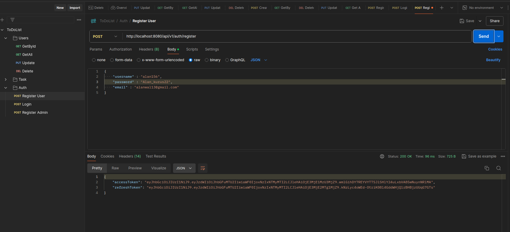

# To Do List with Authentication

Roles:
- ADMIN : can access all user method, todo method and authentications.
- USERS : only access login, create todo, get by id todo, update completed, and update title 
- Authentication : login, register admin, register users 

### Table Master

#### Register Admin

#### Login Admin

#### Register User

#### Login User

#### User Get By Id

#### User Get All

#### Update User

#### Delete User

#### Create Task

#### Get By Id Task

#### Update Completed

#### Update Tiltle

#### Get All Task

#### Delete Task

#### Link Postman
https://www.postman.com/cryosat-engineer-6624182/workspace/todolist/collection/36650247-3791a0ca-73f5-4b07-8b48-25ceb0caf558?action=share&creator=36650247